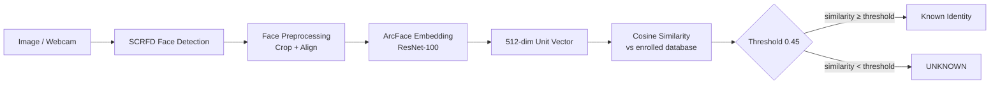

# Face Recognition Identification System

An embedding-based face recognition system using **ArcFace** and **SCRFD** via InsightFace.
New people can be enrolled at any time without retraining — the system learns each person from their face embeddings and rejects unknown faces via a configurable similarity threshold.

---

## Overview

This project implements the full face-recognition pipeline:

```
Input Image / Webcam
       ↓
SCRFD Face Detection   ← locates every face in the frame
       ↓
Face Preprocessing     ← crop, align (handled by InsightFace internally)
       ↓
ArcFace Embedding      ← 512-dimensional unit vector per face
       ↓
Cosine Similarity      ← compare against all enrolled embeddings
       ↓
Threshold Decision     ← similarity ≥ 0.45 → Recognized, else Unknown
       ↓
Known Identity / UNKNOWN
```

The system does **not** use a fixed classifier that must be retrained when new people are added.
It uses **similarity-based matching** in embedding space, so enrollment is instant.

---

## Features

| Feature | Details |
|---|---|
| Face detection | SCRFD (part of InsightFace `buffalo_l`) |
| Face embeddings | ArcFace ResNet-100, 512-dim, pretrained on MS1MV3 |
| Enrollment | Single or multiple images; embeddings are averaged |
| Storage | SQLite (runtime) + `.npy` exports + `metadata.json` |
| Matching | Cosine similarity with configurable threshold |
| Unknown rejection | Scores below threshold → `UNKNOWN` (no forced assignment) |
| Webcam | Real-time recognition with bounding boxes and similarity overlay |
| CLI | `enroll`, `enroll-dataset`, `recognize`, `webcam`, `inspect` |
| REST API | FastAPI backend with 10 endpoints |
| Evaluation | Accuracy, FRR, FAR, unknown rejection rate, threshold sweep |

---

## System Architecture



### Project Layout

```
face-recognition-system/
│
├── config.py                  ← All configurable constants
├── main.py                    ← CLI entry point
├── database.py                ← SQLite storage layer
├── face_model.py              ← Backward-compat shim (SCRFD + ArcFace)
├── matcher.py                 ← Backward-compat shim (wraps src/matcher)
├── evaluate.py                ← Legacy evaluation entry point
├── requirements.txt
├── .gitignore
├── README.md
│
├── src/                       ← Core modules
│   ├── __init__.py
│   ├── detector.py            ← SCRFD face detection
│   ├── embedder.py            ← ArcFace embedding generation
│   ├── matcher.py             ← Cosine-similarity matching + threshold
│   ├── enrollment.py          ← Enrollment pipeline
│   ├── recognition.py         ← Identification pipeline + webcam loop
│   └── utils.py               ← Image I/O, drawing, formatting helpers
│
├── database/
│   ├── embeddings/            ← <name>.npy files (one per enrolled person)
│   └── metadata.json          ← Enrollment registry (human-readable)
│
├── data/
│   ├── enrolled/              ← Enrollment images (one sub-folder per person)
│   └── test/                  ← Test / evaluation images
│
├── evaluation/
│   ├── evaluate.py            ← Full evaluation script with threshold sweep
│   └── results.json           ← Generated output (populated after running)
│
├── backend/
│   └── api/
│       └── main.py            ← FastAPI REST API
│
├── frontend/                  ← React dashboard (Vite)
│   └── src/
│       └── App.jsx
│
├── facedata/                  ← Dataset images saved by the API on enrollment
│
└── tests/
    └── test_matcher.py        ← Unit tests (11 cases, no model loading)
```

---

## Model Details

| Property | Value |
|---|---|
| **Model name** | ArcFace (model pack: `buffalo_l`) |
| **Architecture** | ResNet-100 with ArcFace angular margin loss |
| **Embedding dimension** | 512 float32 values |
| **Pretrained on** | MS1MV3 (~5.8 M identities, ~93 M images) |
| **Framework** | InsightFace + ONNX Runtime |
| **Face detector** | SCRFD (Sample-efficient Face Detector, also in `buffalo_l`) |
| **Execution** | CPU by default; set `EXECUTION_PROVIDER = "CUDAExecutionProvider"` in `config.py` for GPU |
| **Model download** | ~300 MB, automatic on first run (stored in `~/.insightface/`) |
| **LFW benchmark** | 99.83 % (reported by InsightFace) |

**Why ArcFace?**
ArcFace uses an additive angular margin loss that forces embeddings of the same person to cluster tightly and embeddings of different persons to separate clearly.
This makes **cosine similarity** an excellent and interpretable matching metric.
The `buffalo_l` pack is easy to install, works entirely on CPU, and is one of the most accurate open-source face-recognition models available.

---

## Matching Method

### Cosine Similarity

All ArcFace embeddings are **L2-normalized** to unit length before storage and comparison.
For two unit vectors `a` and `b`, their **dot product equals cosine similarity**:

```
similarity = a · b      (∈ [-1, 1], typically [0, 1] for face pairs)
```

A similarity of `1.0` means the embeddings are identical.
A similarity near `0.0` means the faces are unrelated.

### Decision Rule

```python
if similarity >= MATCH_THRESHOLD:
    identity = closest_enrolled_person   # recognized
else:
    identity = "Unknown"                 # rejected
```

The system always finds the **closest** enrolled person, but only accepts the match if the score clears the threshold.
Unknown faces are **never** force-assigned to the closest person.

---

## Threshold

```python
MATCH_THRESHOLD = 0.45   # in config.py
```

This value is **not universally optimal**. It was chosen as a practical starting point for the ArcFace `buffalo_l` model.

| Threshold effect | Low value (e.g. 0.30) | High value (e.g. 0.70) |
|---|---|---|
| Known persons | More accepted (fewer false rejections) | More rejected (more false rejections) |
| Unknown persons | More accepted (more false acceptances) | More rejected (fewer false acceptances) |

**Calibration**: Run `evaluation/evaluate.py --sweep` on your own validation dataset (images not used during enrollment) and select the threshold that gives the best balance between FRR and FAR for your deployment requirements.

---

## Installation

**Requirements**: Python 3.10 or newer (3.11 recommended).

```bash
# 1. Clone the repository
git clone <repository-url>
cd face-recognition-system

# 2. Create and activate a virtual environment
python -m venv venv

# macOS / Linux
source venv/bin/activate

# Windows
venv\Scripts\activate

# 3. Install Python dependencies
pip install -r requirements.txt
```

The ArcFace `buffalo_l` model pack (~300 MB) is downloaded automatically by InsightFace on the **first run**.

### Frontend (optional web dashboard)

```bash
cd frontend
npm install
```

---

## Usage

### Enroll a person (one image)

```bash
python main.py enroll --name "Alice" --image data/enrolled/alice/alice1.jpg
```

### Enroll a person (multiple images — recommended for better accuracy)

```bash
python main.py enroll --name "Alice" \
    --image data/enrolled/alice/alice1.jpg \
           data/enrolled/alice/alice2.jpg \
           data/enrolled/alice/alice3.jpg
```

### Bulk-enroll an entire dataset folder

```bash
python main.py enroll-dataset --dataset data/enrolled
```

Expected folder layout:

```
data/enrolled/
    Alice/
        img1.jpg
        img2.jpg
    Bob/
        img1.jpg
```

### Identify faces in an image

```bash
python main.py recognize --image data/test/unknown.jpg
python main.py recognize --image data/test/unknown.jpg --threshold 0.50
```

Example output:
```
Detected 2 face(s):
  Face 1: Recognized as: Alice  |  similarity=0.812  |  threshold=0.450
  Face 2: UNKNOWN               |  similarity=0.312  |  threshold=0.450
```

### Real-time webcam recognition

```bash
python main.py webcam
python main.py webcam --threshold 0.50 --camera 0
```

- Green box → recognized person (name + similarity score shown)
- Red box   → UNKNOWN face
- Press **`q`** to quit

### Diagnostic inspection

```bash
python main.py inspect --image data/test/photo.jpg
```

---

## Evaluation

```bash
# Evaluate known-person accuracy (leave-one-out cross-validation):
python evaluation/evaluate.py --dataset data/enrolled --threshold 0.45

# Include unknown-person rejection metrics:
python evaluation/evaluate.py --dataset data/enrolled \
    --unknown-dataset data/test --threshold 0.45

# Run threshold sweep and print comparison table:
python evaluation/evaluate.py --dataset data/enrolled --sweep
```

### Evaluation Metrics

| Metric | Description |
|---|---|
| **Accuracy** | Correct identifications / total known samples |
| **False Rejection Rate (FRR)** | Known persons incorrectly classified as Unknown |
| **Unknown Rejection Rate** | Unknown persons correctly rejected |
| **False Acceptance Rate (FAR)** | Unknown persons incorrectly accepted as known |

### Threshold Sweep Table

> [!NOTE]
> **Not evaluated — requires local test dataset.**
> The table below is populated automatically when you run `evaluation/evaluate.py --sweep`
> on your own images.  Values depend on your dataset and lighting conditions.

| Threshold | Known Accuracy | FRR | Unknown Rejection Rate | FAR |
|-----------|----------------|-----|------------------------|-----|
| 0.30 | — | — | — | — |
| 0.35 | — | — | — | — |
| 0.40 | — | — | — | — |
| 0.45 | — | — | — | — |
| 0.50 | — | — | — | — |
| 0.55 | — | — | — | — |
| 0.60 | — | — | — | — |
| 0.65 | — | — | — | — |
| 0.70 | — | — | — | — |
| 0.75 | — | — | — | — |

Run the evaluation script to fill in real numbers.

### Unit Tests

```bash
python -m pytest tests/ -v
# or
python -m unittest discover -s tests -v
```

All 11 unit tests run **without loading the AI model** (pure NumPy — fast).

---

## REST API

Start the FastAPI backend:

```bash
uvicorn backend.api.main:app --host 0.0.0.0 --port 8000
```

| Endpoint | Method | Description |
|---|---|---|
| `/api/status` | GET | System status and enrolled person count |
| `/api/config` | GET | Configuration including current threshold |
| `/api/recognize` | POST | Upload an image and identify faces |
| `/api/enroll` | POST | Enroll a person from uploaded images |
| `/api/people` | GET | List all enrolled persons |
| `/api/recognition/history` | GET | Recognition log (last N events) |
| `/api/people/{name}` | DELETE | Remove an enrolled person |
| `/api/evaluation` | GET | Run and return evaluation results |
| `/api/config/threshold` | PATCH | Update the recognition threshold |
| `/api/health` | GET | Health check |

Interactive API docs: `http://localhost:8000/docs`

### Web Dashboard

```bash
cd frontend
npm run dev
```

Open: `http://localhost:5173`

---

## Failure Cases

| Scenario | System behaviour |
|---|---|
| **No face detected** | Returns empty list / "No face detected" message |
| **Multiple faces in one image** | API returns "Multiple faces detected" and rejects; CLI returns result per face |
| **Poor lighting** | SCRFD may miss the face entirely, or ArcFace produces a weak embedding → likely rejected as Unknown |
| **Side / profile faces** | SCRFD detects frontal faces best; extreme angles (>45°) reduce detection rate |
| **Face covered (mask / glasses)** | Heavy occlusion degrades the ArcFace embedding → similarity drops → likely Unknown |
| **Very small faces** | SCRFD with `det_size=(640,640)` handles faces ≥ ~20 px; tiny faces may be missed |
| **Blurry images** | Blur reduces embedding quality → lower similarity → may reject known persons |
| **Extreme facial angles** | Roll/pitch/yaw beyond 45° degrades both detection and embedding |
| **Similar-looking people** | Cosine similarity may be close; threshold must be tuned carefully |
| **Poor camera quality** | Low-res / compressed images hurt embedding quality |
| **Unseen identities** | Not enrolled → should always be rejected as Unknown (correct behaviour) |
| **Enrollment vs recognition quality mismatch** | High-quality enrollment + low-quality test image → reduced similarity → may trigger FRR |
| **Single enrollment image** | Works but less robust; multiple images from different angles recommended |

---

## Possible Improvements

- **Face alignment**: Use 5-point facial landmark alignment before embedding for better accuracy
- **More enrollment images**: Enroll from multiple angles and lighting conditions
- **Threshold calibration**: Use a proper held-out validation set to select the optimal threshold
- **FAISS indexing**: For databases with hundreds of enrolled persons, use FAISS for fast approximate nearest-neighbour search
- **GPU acceleration**: Set `EXECUTION_PROVIDER = "CUDAExecutionProvider"` in `config.py`
- **Temporal voting**: In webcam mode, vote over several frames before committing to an identity
- **Anti-spoofing / liveness detection**: Add a liveness module to reject photo attacks
- **Image quality filter**: Reject blurry or poorly lit images before enrollment
- **Face tracking**: Track faces across frames to avoid re-identifying the same person every frame
- **Encrypted storage**: Encrypt the SQLite database and `.npy` files at rest
- **Larger pretrained model**: Try `buffalo_sc` for faster CPU inference or a GPU-optimised model for higher throughput

---

## Privacy and Security

> [!CAUTION]
> Face embeddings are **biometric data** derived from a person's physical appearance.

- Store the database file (`faces.db`) and embeddings (`database/embeddings/`) with appropriate filesystem permissions.
- Do not expose the database or `.npy` files via unauthenticated HTTP endpoints.
- Obtain **explicit consent** from individuals before enrolling them.
- Implement a **right-to-erasure** workflow (the `DELETE /api/people/{name}` endpoint supports this).
- Define and communicate a **data-retention policy**.
- Consider encrypting the database at rest for production deployments.
- The embedding alone cannot directly reconstruct the original face image, but it remains personal data under GDPR and similar regulations.

---

## License

This project is provided for educational and research purposes.
Check the licences of InsightFace, ONNX Runtime, and OpenCV before commercial use.